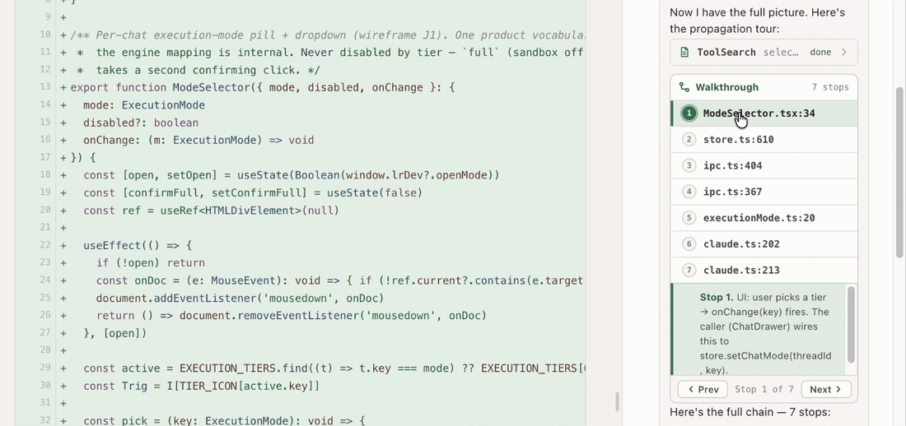
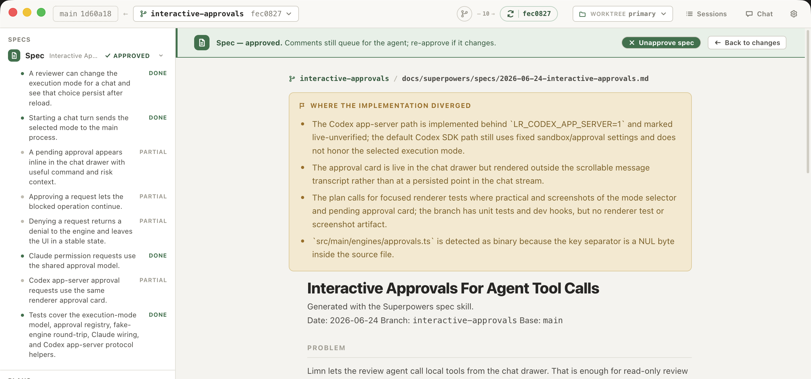
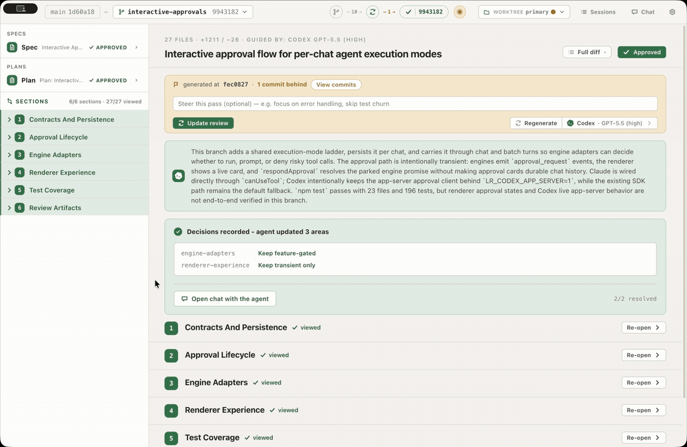

# limn

[](https://github.com/glebmish/limn/actions/workflows/ci.yml)
[](https://github.com/glebmish/limn/releases/latest)
[](LICENSE)

A macOS app for **agentic review of local git branches** that helps you understand the code.


- **Guided review** — Agent explains what has changed, splits changes on semantical groups and asks clarifying questions.
- **Agentic tools** — Tools for agent to help user navigate: navigate to a file that builds a database query, explain the auth workflow across multiple files, etc.
- **Spec/plan cross-check** — flags where the implementation diverged from what the spec and plan define.
- **Comment on anything** — diff lines, spec lines, plan steps, section narration — comment and agent will follow up on it.
- **Agent agnostic** — Supports both Claude and Codex via SDKs.
- **Native support for quick local iterations** — see diff from the last reviewed state, update narration for the new commits.


## What it does

**Narrates the change.** The agent explores callers, tests, and history, then explains how the change actually works — here, a seven-stop tour that follows one value from the UI selector through IPC down to the engine, scrolling the diff to each stop.



**Checks the change against the spec.** Limn auto-discovers specs and plans based on popular conventions and flags where the implementation diverged, criteria by criteria.



**Follows up on comments.** Leave comments on any line, section, or spec point, send them to the agent — it will read callers, run commands, edit files — then report a resolution per comment and commit the changes.


**Shows updates as they come.** When new commits land — from the agent or the user — a titlebar pill shows the drift; after reload, diff shows just the delta. Agent can also update the narration based on the new changes.



## Security & privacy

Limn is a local app with no telemetry, accounts, hosted backend, or cloud sync of
its own. It does not store Claude, Codex, Anthropic, or OpenAI credentials. It uses
the credentials and command-line agents already installed and authorized on your
machine (`claude`, `codex`). Limn also does not use macOS Keychain.

Review state lives in one local SQLite database at the app's user-data location
(`~/Library/Application Support/limn/limn.db` on macOS). That database stores the
review layer: repositories you opened, sessions, comments, chat, generated review
notes, viewed flags, and approvals. Git remains the source of truth for code:
diffs, file contents, and branch state are read from your working tree.

When you choose Claude or Codex, the selected provider receives the prompts and
repository context needed for the review, using your existing provider account or
API key. Limn itself does not send data anywhere else.

Limn runs a coding agent against your repo. The execution tier, set per agent,
controls how much it can do on its own:

- **Ask for approval** / **Accept edits** — the agent confirms before running
  commands; safe defaults for unfamiliar code.
- **Auto mode** / **Full access** — the agent runs shell commands and edits/commits
  without confirming each step.

Only use **Auto mode** or **Full access** on repos you trust. For code you have not
vetted, stay on **Ask for approval** or **Accept edits**.

## Install

### Download the DMG

Download the latest macOS Apple Silicon DMG from [GitHub Releases](https://github.com/glebmish/limn/releases/latest). The release asset is named `Limn-<version>-arm64.dmg`.

The app is distributed as-is: ad-hoc signed, but not Developer ID signed or
Apple-notarized. That is because Limn is a demo tool, not a production product
distribution, and there is no active paid Apple Developer account behind these
builds. After dragging `Limn.app` to `/Applications`, macOS may show **"Limn Not
Opened"** with **"Apple could not verify 'Limn' is free of malware..."**. Remove
the quarantine flag for this app, then open it again:

```bash
xattr -dr com.apple.quarantine /Applications/Limn.app
open /Applications/Limn.app
```

If you installed it somewhere else, replace `/Applications/Limn.app` with that
path.

### Build from source

This avoids the downloaded-app quarantine path because the app is built on your
machine.

```bash
npm install
npm run package
open dist/mac-arm64/Limn.app
```

You can also move `dist/mac-arm64/Limn.app` to `/Applications`.

## Prerequisites

- `git` on your PATH.
- **Claude engine**: a [Claude Code](https://code.claude.com) login (run `claude` once) or `ANTHROPIC_API_KEY`.
- **Codex engine**: `codex login` (ChatGPT plan) or `OPENAI_API_KEY`.

Either engine alone is enough — the picker shows what's authenticated. Subscription logins are inherited from the local Claude/Codex credentials; usage is billed to them.

## Using it

1. **Open a repository** (*Open repository…* / ⌘O) via the native dialog — Limn adds
   it to the **Dashboard**'s repository index and remembers it across launches.
2. On the Dashboard: type to filter the list, ↑/↓ to move, ⏎ (or click) to open a
   repo's sessions. Each row shows its current branch (click the branch chip to open
   that branch's review) and when it was last active.
3. **Opening a repo lands directly on the review** for its current branch — the diff
   against the default base (`main` → `master` → first branch), already loaded. No
   session is minted until you act (comment, mark something viewed, generate, or
   approve); until then the header reads **Draft**.
4. Change the **base** with the ref picker (branches, recent commits, or a typed
   SHA / `HEAD~N` / tag); switch the **branch** — and where it's checked out — with the
   branch/worktree picker. Pick an engine — and optionally a model and reasoning effort
   (Claude Opus/Sonnet `low→max`, Codex GPT-5.x `low→xhigh`; *Auto* uses the engine
   default) — then **Generate guided review**.
5. **Review**: mark files viewed, mark sections reviewed, comment on any diff line,
   section, agent question, or spec/plan line; **Chat** shares the agent's session.
   The **Sessions** button opens the repo hub with every saved review for the repo.
6. **Send N changes to agent** — it edits, commits on your branch, and reports
   per-comment resolutions. **Approve** records the reviewed SHA.

The app **watches the branch** — when commits land from outside (e.g. a Claude Code session in a terminal), a titlebar fetch pill shows the drift and lets you reload when ready. After reload, "changed since viewed" / "changed since approval" rails highlight what moved. You also get a **macOS notification** when an agent run finishes while the app is in the background. Diffs are syntax-highlighted with word-level change marks.

## Limitations

- **macOS, Apple Silicon (arm64) only** — the build target is arm64; there is no Intel or non-macOS build.
- **Not Apple-notarized** — downloaded DMGs require the quarantine-removal step above unless you build locally from source.
- **Local credentials required** — a Claude and/or Codex login (or `ANTHROPIC_API_KEY` / `OPENAI_API_KEY`) must be present on the machine.
- **Single-machine state** — review state is a local SQLite file; it does not sync across machines.
- Early, active development — storage layout and APIs may change.

## Development

Requires Node 20+.

```bash
npm install
npm run dev        # live-reload app
npm test           # vitest: diff parser, ref resolution, sessions DAO, launch args, anchoring, engine contract
npm run typecheck
npm run lint
npm run package    # local package: dist/mac-arm64/Limn.app, plus DMG and zip in dist/
```

Release builds are created by pushing a `v*` tag that matches `package.json`
(`v0.1.2`, for example). The release workflow builds macOS arm64 artifacts and
attaches the DMG, zip, and blockmaps to the GitHub Release.

Useful dev env vars: `LIMN_DEMO=1` (deterministic fake engine), `LIMN_OPEN_REPO` / `LIMN_OPEN_BRANCH` (open straight to the review for a repo/branch), `LIMN_FLOW=generate|chat` (auto-run a flow / open the chat drawer), `LIMN_SHOT=/path.png` (capture the window, with `LIMN_SHOT_DELAY` / `LIMN_SHOT_QUIT`). Real-engine smoke scripts: `npx tsx scripts/smoke-claude.ts` / `smoke-codex.ts`.

**Screenshots:** `npx tsx scripts/shoot.mts` seeds a fixture repo + db and prints `{ repo, db, sessionId, reviewChat, userChat }`; launch Electron with `LIMN_DB` / `LIMN_OPEN_SESSION` + the dev hooks `LIMN_ACTIVE_CHAT=<id>` (activate a chat), `LIMN_OPEN_PICKER=1` (open the agent popover), `LIMN_OPEN_CHATLIST=1` (open the chat dropdown) to capture a specific UI state.

Architecture: see [docs/architecture.md](docs/architecture.md), with deeper dives in [docs/agent-layer.md](docs/agent-layer.md), [docs/storage-layer.md](docs/storage-layer.md), and the [Codex app-server protocol](docs/codex-app-server.md).

## License

[MIT](LICENSE) © Gleb Mishchenko
